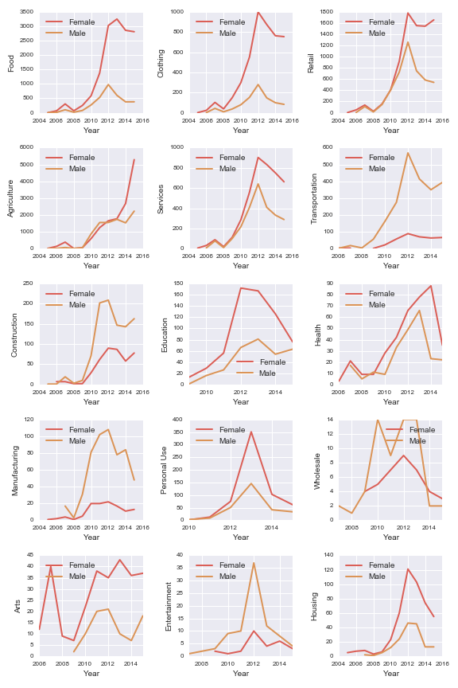
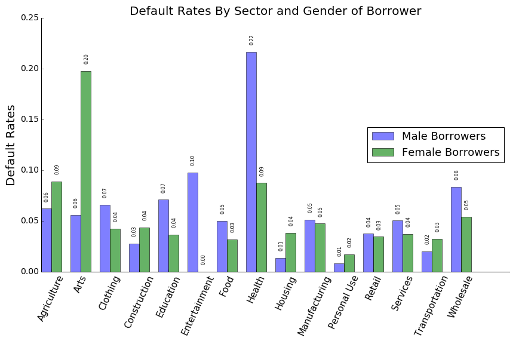

<h1>Kiva in Kenya</h1>

<h2>An Analysis of Micro-loan Activity in an East African Country</h2>

<h3>Non-technical summary</h3>

This analysis is directed at persons interested in the <a href="http://kiva.org/">Kiva microloan development program</a>. Kiva is a development and philanthropy program that provides loans to people who would likely have no other access to credit.  According to its website, Kiva has headquarters in San Francisco and is active in over 80 countries. Kiva works with diverse field partners, including banks, schools and NGOs, to identify and vet potential borrowers.  Kiva donors provide funding either as individuals or groups.  Donors can choose which borrowers they want to support and the funds are then generally provided to partner organisations that disburse the funds, and manage and receive repayments.  In some cases, local trusties may endorse and back loans made to individuals in the local community. 

This analysis is based on publicly available data that can be downloaded free of charge and without special permission from the Kiva website. The analysis uses data from Kenya which, being second in the number of Kiva loans globally, appeared in preliminary analysis to have an amount of data that would be manageable on a Macbook Pro computer with 8GB ram. The analysis provides graphical description of the distribution of Kiva activity in Kenya, and may serve to identify economic sectors that receive relatively little support from the program, for whatever reason. Further, this report describes attempts to model the rate of defaults and to explore gender-specfic information in the descriptions of borrower's situations, as provided to potential donors. 

The results indicate that historical default rates have varied among economic sectors, but are generally under 10% and in most cases under 5%. Default rates increased with loan size, and were gender-specific depending on the economic sector of the loan. Prediction of default on a loan-by-loan basis were largely unsuccessful, owing to the low prevalence of defaulted loans in the data. This was compounded by the fact that nearly all descriptive and geographic information had been purged from records representing defaulted loans. The analysis indicated that there are strong gender differences in the number of awarded loans, depending upon economic sector. While the analysis did not attempt to identify the source of these differences (no data was available on the applicant pool), it did try to determine to what degree the text descriptions of borrower situation and activity were consistent with and predictive of the declared gender of borrower, using natural language processing (NLP). These attempts to identify the gender of the borrower were successful when gender-specific nouns, pronouns and proper nouns were included in the analysis.  Once they were removed, the remaining information on borrowers' activities and situations were insufficient to identify the gender of the borrower. Thus, the text descriptions provide little information, beyond gender-specific words, to use in determining whether the declared use of the loan might be inconsistent with broad patterns of lending indicated in the data (e.g., 'gender spoofing' to take advantage of higher lending to women).

<h3>Data Origin</h3>

The loan data were downloaded as a zipped archive of 2144 files in json format on 24 May 2016 (http://build.kiva.org/docs/data/snapshots).  Additional files with data on lenders and loan-lender indices were also available and inspected, but due to limited content were judged to hold data not central to the analysis.

<h3>Data Wrangling</h3>

The loan data were initially processed sequentially by file (https://github.com/pbpearman/capstone/blob/master/extract_Kenya_loans.ipynb). The following Python libraries were used for wrangling and creating a storable object: pandas, numpy os, json and cPickle. After loading each file (json.load()), three columns required normalisation, after which they were merged to a single pandas dataframe on a shared column. 

<h4>Problems</h4>

Inspection of the imported and normalised json files indicated that further flattening (normalisation) could be attempted.  However, these features (e.g., 'terms', 'location', 'journal_totals') were of variable lengths.  When normalised using json_normalize(), flattened cells were inserted into the pandas dataframe as new row segments, corresponding to some number of new features.  However, the number of new features  varied in length from row to row.  Despite this, the apply function that implemented json_normalize() did not throw an exception.  The result was corruption of the pandas dataframe: apparently the rows varied in length and consistent reference with df.iloc[] was impossible.  Due to time constraints, I chose not to pursue flattening these features.  However, I did extract information to create features quantifying the gender of the borrower or group of borrowers (https://github.com/pbpearman/capstone/blob/master/kenya_wo_problems.ipynb).

Additionally, I initially had hoped to include a geographic component into the analysis by using geographic coordinates and/or city and town names.  The great majority of loan records were represented by coordinates that simply indicated a point at 1 arc degree of resolution, sufficient to pinpoint the country of Kenya.  Nominal references to town sometimes indicated entire small cities, while the indicated economic sector suggested that the location must be suburban or rural.  These inconsistencies in data quality led me to abandon the idea of including an explicit geographical component in the analysis.
Finally, near the end of the analysis, I had a spontaneous impulse to examine the data for duplicate records.  This revealed over 6000 records in which the loan id, borrower's name, funded date, repayment status and descriptive text were duplicated in additional records.  While other aspects of the loan may have changed (re-classification to another economic sector), I chose to keep only the first occurrence of a record as identified by these variables jointly, and re-ran analyses as necessary.

<h4>Lessons learned</h4>

While the general patterns in the data were not affected by duplicate records, one should examine an unknown dataset for duplicate records at or near the beginning of an analysis.  Perhaps more importantly, the normalisation of serial data, as in json-format files, can not simply be assumed successful when no error messages arise. Additional testing may reveal irregularities that have not been immediately apparent or, as happened here, anomalous and confusing results may require de-bugging and eventually lead to the problem. For example, I might have been able to detect problems had I examined the number of cells with NaN values, or exported the pandas dataframe to cvs, or run a function to actually test the number of cells in each row after normalisation of the json files.

<h3>Data Patterns</h3>

The story told by patterns in the data is one of renewed growth in lending, strong differences in borrowing among economic sectors, and gender differences.  These differences appear both in patterns of borrowing by men and women, and also in differences in default rates between male and female borrowers.  To simplify the analyses, I largely focused on loans to individuals and often ignored loans to organisations, loosely defined as groups of people.  These loans to single borrowers make up 92.6% of Kiva loans (repaid and defaulted) in Kenya.  This is justified by the likelihood that the lending and repayment histories of multi-borrower loans are likely more complicated than those of loans to single borrowers, may be subject to different processes that influence repayment, and may often constitute special case instances, especially when loans are relatively large.

For example, loans to groups of people tend to involve more lenders and be for larger amounts, suggesting that the risks associated with these loans may differ from those associated with loans to single borrowers:
lender</em>num_borrowers" title="">

In addition, this analysis takes an historical perspective by focusing on loans that have been repaid or for which the borrower is in default, and excludes loans still in repayment.  Thus, the report addresses the great majority of Kiva loans.

The Kiva loan program is known for making 'microloans', so it is not surprising that the vast majority of loans are very small by comparison with what one might expect in the developed world.

In general, the number of loans made in Kenya showed steady growth from 2009-2012, while much of the world was in the grip of a financial crisis.  Then, after two years of relative stability, Kiva loan activity is again increasing.

The growth in the numbers of loans varies greatly among economic sectors in Kenya.  In fact, the growth in Kiva lending activity in Kenya since 2012 has been driven by loans in support of activity in the agricultural sector.  Loans to all other sectors have remained near their 2012 values, or have decreased up to about 10%.

Recently, the number of loans to activities in the agricultural sector has outpaced lending in all other sectors combined.

Most of the growth in the number of loans in the agriculture sector is comprised of loans to women.

Only in the sectors transportation, construction and manufacturing do loans to men dominate numerically.

<h4>Patterns of Defaults in Kiva Loan Data</h4>

In addition to sector and gender-specific patterns in borrowing, I was interested in whether there were also sector- and gender-specific patterns in default rates.  Several factors appear to have influenced default rates historically (see ipython notebook at this link: https://github.com/pbpearman/capstone/blob/master/Kiva_loan_analysis_defaults.ipynb)

In general, when considering loans to single individuals, larger loans have had higher default rates.
x</em>loan_size" title="">

Overall, there is no obvious effect of gender on default rate.
by</em>gender.png" title="">

There are, however, differences between genders in the default rate as a function of loan size.  A Chi-square test supports the contention that the relative default rate for loans to men and women depends on the size of the loan (P&lt;0.001).
gender</em>size" title="">

When one examines sector-specific default rates by gender, one finds substantial variation among sectors.  Despite the strong gender differences that depend on sector, there is no significant trend in default rates between genders over all (z=0.13, P>0.05)
gender</em>sector" title="">

<h3>Emergent questions</h3>

The patterns I have described above show two prominent trends.  The first is that the recent growth in Kiva lending is primarily due to an increase in loans to women in support of agricultural projects.  There are several possible explanations for this. First, more women may be applying for loans and entering into market agriculture.  To examine this possibility, one would want data on initial (first step) loan applications.  These data are not readily available publicly.  Another, although less likely, possibility is that men are having their wives apply ('gender spoofing'), perhaps knowing that more loans are going to women. Whether this happens due to decisions within the family is not knowable, but one might search for differences in the text descriptions of agricultural loans to men and women, to see if there is some underlying signal of gender.  If so, then one could potentially address the question of whether the text descriptions of loans to women differ between periods demarcated by the sharp increase in the number of loans to women.

Second, the descriptive analysis above seems to indicate that under some circumstances, loans to women may be more susceptible to default. If one could <em>a priori</em> identify loans that appear more susceptible to default, appropriate action could be taken to either provide these applicants with additional resources and support to ensure success, or to deny loans that are particularly risky. To do this, one would need to be able to successfully predict the risk of default. Can risk of default be predicted?  While this would seem to be a valid question, the generally low rate of default complicates the development of a predicitive model.  Given the time available here, I wanted to attempt to develop a simple model of default risk, incorporating the available features in the data.

<h3>Feature Engineering and Classifier Development</h3>

<h4>Identifying Cases of Gender Spoofing in Kiva Loan Data: Natural Language Processing</h4>

The high rate of lending to women may be a motivation for some potential borrowers to spoof the system, basically putting up a women to apply for agricultural loans that would be used by a man, either for agriculture or other purposes. The goal of this exercise was to see whether using Natural Language Processing a classifier could be trained to consistently identify the gender of a borrower.  Such a reliable classifier could be used to determine whether the situation described in the text is consistent with the borrower's gender.  One could then train the classifier on pre-2014 data, before the upswing in agriculture loans to women, and apply it to loans in the years 2014-2015.  

I identified the text descriptions as the richest potential source of information on the gender of the borrower, outside of the declared gender in the loan record. The length of these text descriptions varies greatly among loan records, as seen below.
char</em>len" title=""> 

The length of the descriptions has also varied among years, but recently has on average remained between 500 and about 700 characters.
len</em>years" title="">

In trial runs of a Naive Bayesian classifier, I developed an extended set of stop words (ones that would be ignored in the generation of potentially predictive features).  Initially, these included simple gender-specific words such as husband, wife, business woman, etc.  I also removed the name of the borrower from the text, as this would be strongly associated with the borrower's gender.  I then partitioned the data into training (70%) and test partitions, and used these to fit and validate the Naive Bayes classifier. I used a simple count vectorizer to create features that expressed the importance of particular words in the collection of text descriptions. 

First I trained the classifier using a log likelihood criterion in determining the cross-validation performance score, using simple word frequency.  This resulted in fairly low accuracy when the best fitted model was used to predict the test data (accuracy=0.57). I identified a set of 23 'influential words', ones strongly associated (>= 0.75) with the borrower being female. I trained the classifier on these words, but prediction accuracy on the test data increased only to 0.66, indicating little improvement.

I then used the same parameter values to run cross-validation using maximisation of AUC-ROC as the criterion for choosing the best model.  This resulted in increased accuracy (0.79 on the test data) and identified a large number of proper nouns that were associated with the gender of the borrower.  Changing to using a TF/IDF vectorizer, still with AUC-ROC as the cross-validation criterion for best model, resulted in improved accuracy on the test data (0.86).

I then trained the classifier on data on features constructed from texts from agriculture sector loans originating in 2013 and earlier. These predictions were fairly good, with accuracy and AUC-ROC both producing similar values to the initial run, around 0.85 and the recall value about 0.88.   These analyses can be found in the second half of this file https://github.com/pbpearman/capstone/blob/master/Kiva_loan_data_analysis.ipynb  

However, a large number of English and non-English proper nouns were strongly associated with the gender of the borrower, although they were not the name feature. These were not the kinds of predictors I was seeking.  I was more interested in predictors that indicated either activities or objects, something more substantive and value-oriented, and not as easily manipulated as persons names.  I removed these names by using a regular expression to identify and remove all proper nouns, defined as words that began with a capital letter.  These words were added to the list of stop words and the texts were re-vectorized using the TF-IDF vectorizer.  After removal of the names, accuracy upon prediction on the test data partition dropped to 0.61 and AUC-ROC fell to 0.6. With such low values, classification based on a NLP analysis of the texts would be insufficient to identify texts that are inconsistent with the gender of the applicant.  Use of data from all sectors and pre-2014 yielded a classifier with AUC-ROC of 0.66 and recall of 0.87.  While that might be sufficient for prediction in some circumstances, a high performing classifier would have been needed to focus in on a small number of misclassified loans as possibly representing cases in which the text description was inconsistent with the gender of the borrower. 

<h4>Machine Learning to Model Default Risk</h4>

The prediction of loans with high risk of default would be a valuable function, likely aiding many of the parties involved in the Kiva system.  Borrowers could be offered additional assistance while local partners and lenders would have additional information on which to make decisions.

The generally low rate of defaults means that predicting default is an exercise in predicting a rare event.  Most classifiers would do well by simply identifying most loans as not at risk of default.  Thus, developing a high-performance classifier would be a challenge even with abundant observations and many features.  Unfortunately, records of defaulted loans had been pruned of potentially helpful information, such as text descriptions of borrower circumstances, payment data and location.  This left gender, economic sector and loan size as potential features, and I used them all.

I examined two potential methods to artificially increase the prevalence of defaulted loans in the training data.  These are found in the ipython notebook https://github.com/pbpearman/capstone/blob/master/Kiva_loan_analysis_defaults.ipynb.  First, I constructed a training dataset by subsampling so that it consisted of only 1.3 times as many non-default as defaulted loans, effectively inflating the frequency of defaulted loans.  Second, I constructed a second training dataset by oversampling (repeating) the observations of default loans, so that they constituted about 40% of the training dataset instead of just 5%.  I then trained and evaluated a logistic regression classifier.  While this is not the highest-performing type of classifier, I used it as an example and an indicator of what might be possible with more advanced methods.  For both datasets, I examined the effect of optimising over a range of the parameter C and used 10-fold cross validation to evaluate classifier performance.  I initially used a feature matrix that was constructed by pivoting the sector feature into a matrix of 1,0 values in features that corresponded to the individual values (strings of characters) of the sector feature.  The matrix had, additionally, values for the gender of the borrower and the amount of the loan.  Thus, this was consistent with the columns being interpreted as a design matrix of linear effects with no interactions.  I constructed training, test, and hold-out data partitions, and did 5-fold cross-validation to choose the best value of the C parameter.

In training on the subsampling dataset, AUC-ROC on the test dataset was 0.63 while recall was 0.47.  I then tested the classifier's performance on the health sector data alone because of the higher default rate of these data. When tested on these data, AUC-ROC was higher than previously (0.68) and recall reached a value of 0.86.  This suggests that the model performed substantially better in data with higher default rates, as one would expect.  Prediction on the hold out data set produced AUC-ROC value of 0.61 and recall of 0.44, consistent with prediction on the test data.

The logistic regression classifier that was trained on the oversampling dataset performed similarly to the previous classifier: prediction on the hold out data produced an AUC-ROC value of 0.60 while recall was 0.35.

I then examined the possibility that a more complex model might produce a better result (see the ipython notebook at https://github.com/pbpearman/capstone/blob/master/Kiva_loan_analysis_defaults_LR.ipynb).  I used the dmatrix function in the patsy library to construct a design matrix with interactions between each of the sectors and the gender of the borrower in single-borrower loans, and I also included the linear effects of each of the features, including loan size.  I then used subsampling to construct the final dataset, and partitioned it into training and test portions. 

The trained classifier performed similarly to the simple model.  The value of AUC-ROC was 0.62; recall was 0.44 and overall accuracy was 0.64.  Thus it appears that prediction of defaults using the available features and their interactions was not terribly successful with logistic regression.

<h3>Conclusions</h3>

Graphical analysis and associated statistical tests revealed gender differences in borrowing and in probabilities of default that were specific to particular sectors of the Kenyan economy.  In the exercise in the use of NLP to identify gender from text, I found that using maximisation of AUC-ROC values led to higher overall accuracy than maximising likelihood.  This is surprising and begs the question of whether this is a general result.  In any case, the results of prediction of gender of borrower, once names and gender-specific terms were removed from the test data, was not very successful.  This is likely due to the limited information included in the text descriptions.  The mean length of the text descriptions was always less than 900 characters over the entire history of Kiva loans.  This amount of text information is likely inadequate to reveal something of the personal values and larger goals that might indicate gender differences. Further, the descriptions were written by representatives of the partner organisations and neither written by the borrower themselves, nor transcribed from their spoken statements. This also may have limited the information content of the descriptions.

Prediction of loan defaults turned out to be challenging, despite the presence of substantial differences in default rates among economic sectors. Further, the size of the loan also had an effect on default rates. This suggests that borrowers who receive larger loans need additional resources, such as help with goal establishment, and potentially financial and operations planning, to reduce rates of default.   While I used a simple logistic regression classifier, use of a more sophisticated classifier might have produced better results.  However, the limited number of features and their characteristics were likely also a limiting factor.  Other features that include more on the business history, experience, analytical ability and other personal characteristics might have produced an improved result, but were unavailable.  Also, location data and descriptive text had been removed from the record of defaulted loans.  This prevented me from using location information to search for clusters of loan defaults, and to use NLP to search for additional informative features.   

Overall, the publicaly available data on Kiva microloans in Kiva was sufficient to reveal interesting and informative patterns in the data.  It would be useful to also have data on all loan applications, regardless of whether they were eventually included in the Kiva program or not.  It is unclear whether low rates of lending in some economic sectors is due to a scarcity of applicants, a scarcity of interest in opportunities for financing, or low rates of qualification for credit. 

Further analysis could be extended to additional countries, in order to make cross-country comparisons.  This would involve substantially more data, and the degree to which the data are amenable to such comparisons is not known.  There may be differences in records that could limit such comparisons.  Alternatively, records from some countries may provide information that was not available in the records from Kenya.

